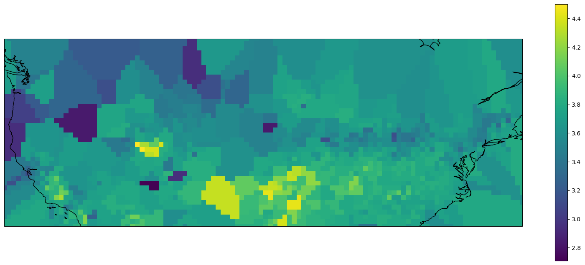
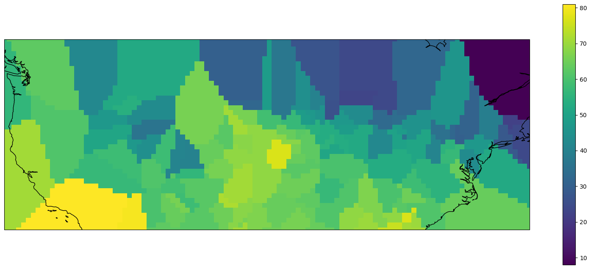
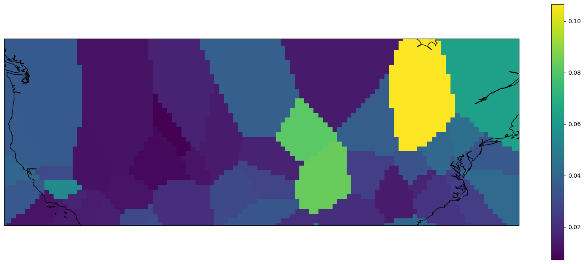

# Estimating Local Air Quality with Ground-based Aerosol Optical Depth Measurements and Meteorological Conditions

This report describes the approach of using several machine learning models to estimate local Air Quality Index (AQI) values using Aerosol Optical Depth (AOD) measurements from AeroNET and local meteorological conditions on an interpolated grid.

***

## Introduction 

This effort is driven by the desire to predict daily average air quality represented by AQI using the minimum amount of information, including the most basic local meteorological conditions and  AOD measurements from a sparsely located ground-based instrument network (AERONET), without relying on satellite measurements which are ineffective in cloudy conditions or complex global chemistry models. 

## Data

Three datasets are used in this project:  

1. [Daily AQI][1] summary in the year 2022 provided by the EPA includes the monitor site locations, ozone concentrations, and AQI values. Monitor locations are used for interpolation onto a uniform grid, ozone concentrations are used as an input feature, and log(AQI) values are the regression target due to the wide range of raw AQI values. A cleaned up snippet of this dataset is shown below:   

	<div>
<style scoped>
    .dataframe tbody tr th:only-of-type {
        vertical-align: middle;
    }

    .dataframe tbody tr th {
        vertical-align: top;
    }

    .dataframe thead th {
        text-align: right;
    }
</style>
<table border="1" class="dataframe">
  <thead>
    <tr style="text-align: right;">
      <th></th>
      <th>Date Local</th>
      <th>Latitude</th>
      <th>Longitude</th>
      <th>Ozone</th>
      <th>AQI</th>
    </tr>
  </thead>
  <tbody>
    <tr>
      <th>0</th>
      <td>2022-02-28</td>
      <td>30.497478</td>
      <td>-87.880258</td>
      <td>0.038000</td>
      <td>35</td>
    </tr>
    <tr>
      <th>1</th>
      <td>2022-03-01</td>
      <td>30.497478</td>
      <td>-87.880258</td>
      <td>0.037235</td>
      <td>50</td>
    </tr>
    <tr>
      <th>2</th>
      <td>2022-03-02</td>
      <td>30.497478</td>
      <td>-87.880258</td>
      <td>0.038235</td>
      <td>51</td>
    </tr>
    <tr>
      <th>3</th>
      <td>2022-03-03</td>
      <td>30.497478</td>
      <td>-87.880258</td>
      <td>0.024333</td>
      <td>40</td>
    </tr>
    <tr>
      <th>4</th>
      <td>2022-03-04</td>
      <td>30.497478</td>
      <td>-87.880258</td>
      <td>0.049647</td>
      <td>77</td>
    </tr>
  </tbody>
</table>
</div>

2. [Meteorological conditions][2] including monitor site locations, daily averaged precipitation, snow depth, snowfall, maximum temperature, and minimum temperature provided by NOAA are interpolated in the same manner as AQI and aggregated as input features. Similarly, below is an example of the raw dataset:

	<div>
<style scoped>
    .dataframe tbody tr th:only-of-type {
        vertical-align: middle;
    }

    .dataframe tbody tr th {
        vertical-align: top;
    }

    .dataframe thead th {
        text-align: right;
    }
</style>
<table border="1" class="dataframe">
  <thead>
    <tr style="text-align: right;">
      <th></th>
      <th>DATE</th>
      <th>LATITUDE</th>
      <th>LONGITUDE</th>
      <th>ELEVATION</th>
      <th>PRCP</th>
      <th>SNOW</th>
      <th>SNWD</th>
      <th>TMAX</th>
      <th>TMIN</th>
    </tr>
  </thead>
  <tbody>
    <tr>
      <th>0</th>
      <td>2022-03-01</td>
      <td>44.4044</td>
      <td>-123.7533</td>
      <td>70.1</td>
      <td>2.27</td>
      <td>0.0</td>
      <td>0.0</td>
      <td>56.0</td>
      <td>51.0</td>
    </tr>
    <tr>
      <th>1</th>
      <td>2022-03-02</td>
      <td>44.4044</td>
      <td>-123.7533</td>
      <td>70.1</td>
      <td>0.74</td>
      <td>0.0</td>
      <td>0.0</td>
      <td>52.0</td>
      <td>49.0</td>
    </tr>
    <tr>
      <th>2</th>
      <td>2022-03-03</td>
      <td>44.4044</td>
      <td>-123.7533</td>
      <td>70.1</td>
      <td>0.62</td>
      <td>0.0</td>
      <td>0.0</td>
      <td>50.0</td>
      <td>45.0</td>
    </tr>
    <tr>
      <th>3</th>
      <td>2022-03-04</td>
      <td>44.4044</td>
      <td>-123.7533</td>
      <td>70.1</td>
      <td>0.02</td>
      <td>0.0</td>
      <td>0.0</td>
      <td>49.0</td>
      <td>38.0</td>
    </tr>
    <tr>
      <th>4</th>
      <td>2022-03-05</td>
      <td>44.4044</td>
      <td>-123.7533</td>
      <td>70.1</td>
      <td>0.15</td>
      <td>0.0</td>
      <td>0.0</td>
      <td>44.0</td>
      <td>36.0</td>
    </tr>
  </tbody>
</table>
</div>

4. [Aerosol Optical Depths][3] measured by a network of ground-based instruments called the Aerosol Robotic Network (AERONET) covering a range of wavelengths are the final components of input features (example shown below).

	`AOD table`
	<table>
	<tr>
		<th>Date</th>
	  <th>Latitude</th>
	</tr>
	<tr>
		<th>Longitude</th>
	  <th>Site_Elevation(m)</th>
	</tr>
	<tr>
		<th>AOD_1640nm</th>
	  <th>AOD_1020nm</th>
  </tr>
	<tr>
	  <th>AOD_870nm</th>
	  <th>AOD_865nm</th>
  </tr>
	<tr>
	  <th>AOD_779nm</th>
	  <th>AOD_675nm</th>
  </tr>
	<tr>
	  <th>AOD_667nm</th>
	  <th>AOD_620nm</th>
  </tr>
	<tr>
	  <th>AOD_560nm</th>
	  <th>AOD_555nm</th>
  </tr>
	<tr>
	  <th>AOD_551nm</th>
	  <th>AOD_532nm</th>
  </tr>
	<tr>
	  <th>AOD_531nm</th>
	  <th>AOD_510nm</th>
  </tr>
	<tr>
	  <th>AOD_500nm</th>
	  <th>AOD_490nm</th>
  </tr>
	<tr>
	  <th>AOD_443nm</th>
	  <th>AOD_440nm</th>
  </tr>
	<tr>
	  <th>AOD_412nm</th>
	  <th>AOD_400nm</th>
  </tr>
	<tr>
	  <th>AOD_380nm</th>
	  <th>AOD_340nm</th>
  </tr>
	<tr>
	  <th>AOD_681nm</th>
	  <th>AOD_709nm</th> 
  </tr>
  </table>

After aggregating all input features and trimming off undesired features such as faulty measurements of AOD on some wavelengths, 16 input features were obtained and are shown below. Note that "ELEVATION" references monitor sites elevation of meteorological data while "Site_Elevation(m)" refers those of AOD instruments.

<table>
    <tr>
		<th>Ozone</th>
		<th>ELEVATION</th>
    </tr>
	<tr>
		<th>PRCP</th>
		<th>SNOW</th>
	</tr>
	<tr>
		<th>SNWD</th>
		<th>TMAX</th>
  	</tr>
	<tr>
		<th>TMIN</th>
		<th>Site_Elevation(m)</th>
	</tr>
	<tr>
		<th>AOD_1640nm</th>
		<th>AOD_1020nm</th>
	</tr>
	<tr>
		<th>AOD_870nm</th>
		<th>AOD_675nm</th>
	</tr>
	<tr>
		<th>AOD_500nm</th>
		<th>AOD_440nm</th>
	</tr>
	<tr>
		<th>AOD_380nm</th>
		<th>AOD_340nm</th>
	</tr>
</table>

All three datasets have a similar format with monitor site locations and measurement dates. The three datasets for the entirety of 2022 were downloaded but only data from March 1 to May 1 are used due to memory limitations.

Data preprocessing includes minor renaming, reformatting, and replacing invalid values before looping through the selected dates. In each loop, only the data on the specified date in each dataset are selected and separately interpolated onto a uniform grid covering the mainland U.S. with a resolution of 0.5 degrees. After each iteration, the interpolated values for each feature are flattened to a 1-D vector and appended with those from other dates. Hence the number of training instances without trimming off invalid data is the number of individual cells on the uniform grid multiplied by the number of days, which in this case is 272,800 instances. The preprocessing loop is shown below:

[1]: https://aqs.epa.gov/aqsweb/airdata/download_files.html#AQI
[2]: https://www.ncei.noaa.gov/maps/daily/
[3]: https://aeronet.gsfc.nasa.gov/

```python
preprocessing loop
```

Below are examples of interpolated values of one feature from each of the three datasets for March 1 using the "nearest" method plotted onto the uniform grid:

    

    
    

    
    


It is shown that AOD measurements, although covering a wide range of wavelengths, are sparse even for a relatively coarse grid of 0.5 degree resolution. The original plan was to include satellite measurements at higher resolutions to increase the reliability. However, due to the reason mentioned before that satellite measurements are unusable at cloudy conditions and inconsistent across different land types, (reference) and that satellite data products were given in a format difficult to implement in this project, only the three datasets which are all produced by local ground-based monitor sites are used. The consequences of these sparse measurements will be discussed later.

## Model prediction
After the numerous testing, the only model capable of providing reliable results is the decision tree regressor from the sci-kit learn library. The model is incorporated into a pipeline with a standard scaler and the process is shown below:

```python
from sklearn.model_selection import train_test_split

target = 'AQI'

X_data=combined_df.drop([target],axis=1).values
y_data=combined_df[target].values
y_data = y_data.reshape(-1,1)

test_size = 0.3
X_train, X_test, y_train, y_test = train_test_split(X_data, y_data, test_size=test_size)

from sklearn.tree import DecisionTreeRegressor

pipe2 = Pipeline([('scaler', StandardScaler()), ('regressor', DecisionTreeRegressor())])
pipe2.fit(X_train, y_train)
y_pred_tree = pipe2.predict(X_test)
```
The RMSE of scaled data for this model is `0.287` and its REC is shown below:
```
REC
```
It is shown that even with a limited amount of features and sparse measurements of AOD, the decision tree model can reliably produce accurate results of AQI, proving it possible to estimate local air quality without too much high-resolution satellite measurements as long as an appropriate model is used.
## Discussions
Besides the successful decision tree regression, linear regression, artificial neural network, random forest, and deep neural network models are also tested and they all produced unacceptable results. RECs for all models tested are shown below:

It is unclear why decision tree model outperforms other models by such a significant margin besides its known advantage in nonlinear behavior. The poor performance of other models can be attributed to the interpolation method used, which introduces a significant amount of errors especially in large regions with sparsely located monitor sites. Adding this to the already sparse AOD measurements even in more populated areas, it is clear how simple models such as linear regression will not produce reliable results especially when there is not enough physically relevant features to PM2.5 except for AOD measurements. 
## References
[1] DALL-E 3

[back](./)

