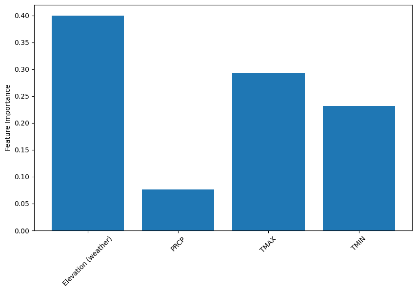

# Estimating Local Daily Average Air Quality with Ground-based Aerosol Optical Depth Measurements and Meteorological Conditions

This report describes the approach of using machine learning models to estimate local Air Quality Index (AQI) values using sparse ground-based Aerosol Optical Depth (AOD) measurements and local meteorological conditions, all interpolated onto a uniform grid.

***

## Introduction 

This effort is driven by the desire to predict daily average air quality represented by particulate matter AQI using the minimum amount of information, including the most basic local meteorological conditions and  AOD measurements from sparsely located ground-based instruments called the Aerosol Robotic Network (AERONET), without relying on satellite measurements which are ineffective in cloudy conditions or complex global chemistry models which are expensive. Furthermore, models are trained separately in different months of 2022 to show the effects of major pollution events such as wildfires on model performance.

## Data

Three datasets are used in this project:  
-   [Daily AQI][3] summary in the year 2022 provided by the EPA includes the monitor site locations, ozone AQI, and particulate matter AQI values. Monitor site locations are used for interpolation onto a uniform grid. Ozone AQI is ignored and only particulate matter AQI is used as the prediction target due to the wide range of raw AQI values. A cleaned up snippet of this dataset is shown below:   

<table border="1" class="dataframe">
  <thead>
    <tr style="text-align: right;">
      <th></th>
      <th>Date Local</th>
      <th>Latitude</th>
      <th>Longitude</th>
      <th>AQI</th>
    </tr>
  </thead>
  <tbody>
    <tr>
      <th>0</th>
      <td>2022-02-28</td>
      <td>30.497478</td>
      <td>-87.880258</td>
      <td>35</td>
    </tr>
    <tr>
      <th>1</th>
      <td>2022-03-01</td>
      <td>30.497478</td>
      <td>-87.880258</td>
      <td>50</td>
    </tr>
    <tr>
      <th>2</th>
      <td>2022-03-02</td>
      <td>30.497478</td>
      <td>-87.880258</td>
      <td>51</td>
    </tr>
    <tr>
      <th>3</th>
      <td>2022-03-03</td>
      <td>30.497478</td>
      <td>-87.880258</td>
      <td>40</td>
    </tr>
    <tr>
      <th>4</th>
      <td>2022-03-04</td>
      <td>30.497478</td>
      <td>-87.880258</td>
      <td>77</td>
    </tr>
  </tbody>
</table>  

-   [Meteorological conditions][4] including monitor site locations, daily averaged precipitation, snow depth, snowfall, maximum temperature, and minimum temperature provided by NOAA are interpolated in the same manner as AQI and used as input features. Similarly, below is an example of the raw dataset:  

<table border="1" class="dataframe">
  <thead>
    <tr style="text-align: right;">
      <th></th>
      <th>DATE</th>
      <th>LATITUDE</th>
      <th>LONGITUDE</th>
      <th>Elevation (weather)</th>
      <th>PRCP</th>
      <th>SNOW</th>
      <th>SNWD</th>
      <th>TMAX</th>
      <th>TMIN</th>
    </tr>
  </thead>
  <tbody>
    <tr>
      <th>0</th>
      <td>2022-03-01</td>
      <td>44.4044</td>
      <td>-123.7533</td>
      <td>70.1</td>
      <td>2.27</td>
      <td>0.0</td>
      <td>0.0</td>
      <td>56.0</td>
      <td>51.0</td>
    </tr>
    <tr>
      <th>1</th>
      <td>2022-03-02</td>
      <td>44.4044</td>
      <td>-123.7533</td>
      <td>70.1</td>
      <td>0.74</td>
      <td>0.0</td>
      <td>0.0</td>
      <td>52.0</td>
      <td>49.0</td>
    </tr>
    <tr>
      <th>2</th>
      <td>2022-03-03</td>
      <td>44.4044</td>
      <td>-123.7533</td>
      <td>70.1</td>
      <td>0.62</td>
      <td>0.0</td>
      <td>0.0</td>
      <td>50.0</td>
      <td>45.0</td>
    </tr>
    <tr>
      <th>3</th>
      <td>2022-03-04</td>
      <td>44.4044</td>
      <td>-123.7533</td>
      <td>70.1</td>
      <td>0.02</td>
      <td>0.0</td>
      <td>0.0</td>
      <td>49.0</td>
      <td>38.0</td>
    </tr>
    <tr>
      <th>4</th>
      <td>2022-03-05</td>
      <td>44.4044</td>
      <td>-123.7533</td>
      <td>70.1</td>
      <td>0.15</td>
      <td>0.0</td>
      <td>0.0</td>
      <td>44.0</td>
      <td>36.0</td>
    </tr>
  </tbody>
</table>  

-   [Aerosol Optical Depths][5] measured by AERONET covering a range of wavelengths are the final components of input. A portion of this dataset is shown here:    
	

<table border="1" class="dataframe">
  <thead>
    <tr style="text-align: right;">
      <th></th>
      <th>Date</th>
      <th>Latitude</th>
      <th>Longitude</th>
      <th>Elevation (AERONET)</th>
      <th>AOD_1640nm</th>
      <th>AOD_1020nm</th>
      <th>AOD_870nm</th>
      <th>AOD_865nm</th>
      <th>AOD_779nm</th>
      <th>AOD_675nm</th>
      <th>AOD_667nm</th>
      <th>AOD_620nm</th>
      <th>AOD_560nm</th>
      <th>AOD_555nm</th>
      <th>AOD_551nm</th>
      <th>AOD_532nm</th>
      <th>AOD_531nm</th>
      <th>AOD_510nm</th>
      <th>AOD_500nm</th>
      <th>AOD_490nm</th>
      <th>AOD_443nm</th>
      <th>AOD_440nm</th>
      <th>AOD_412nm</th>
      <th>AOD_400nm</th>
      <th>AOD_380nm</th>
      <th>AOD_340nm</th>
      <th>AOD_681nm</th>
      <th>AOD_709nm</th>
    </tr>
  </thead>
  <tbody>
    <tr>
      <th>0</th>
      <td>2022-12-30</td>
      <td>-62.663056</td>
      <td>-60.389444</td>
      <td>5.0</td>
      <td>0.049188</td>
      <td>0.059211</td>
      <td>0.062151</td>
      <td>-999.0</td>
      <td>-999.0</td>
      <td>0.066013</td>
      <td>-999.0</td>
      <td>-999.0</td>
      <td>-999.0</td>
      <td>-999.0</td>
      <td>-999.0</td>
      <td>-999.0</td>
      <td>-999.0</td>
      <td>-999.0</td>
      <td>0.073626</td>
      <td>-999.0</td>
      <td>-999.0</td>
      <td>0.083497</td>
      <td>-999.0</td>
      <td>-999.0</td>
      <td>0.079924</td>
      <td>0.082425</td>
      <td>-999.0</td>
      <td>-999.0</td>
    </tr>
    <tr>
      <th>1</th>
      <td>2022-03-01</td>
      <td>40.451900</td>
      <td>-3.723950</td>
      <td>680.0</td>
      <td>-999.000000</td>
      <td>0.050193</td>
      <td>0.056500</td>
      <td>-999.0</td>
      <td>-999.0</td>
      <td>0.067353</td>
      <td>-999.0</td>
      <td>-999.0</td>
      <td>-999.0</td>
      <td>-999.0</td>
      <td>-999.0</td>
      <td>-999.0</td>
      <td>-999.0</td>
      <td>-999.0</td>
      <td>0.095629</td>
      <td>-999.0</td>
      <td>-999.0</td>
      <td>0.115899</td>
      <td>-999.0</td>
      <td>-999.0</td>
      <td>0.140979</td>
      <td>0.151545</td>
      <td>-999.0</td>
      <td>-999.0</td>
    </tr>
    <tr>
      <th>2</th>
      <td>2022-03-02</td>
      <td>40.451900</td>
      <td>-3.723950</td>
      <td>680.0</td>
      <td>-999.000000</td>
      <td>0.020488</td>
      <td>0.023579</td>
      <td>-999.0</td>
      <td>-999.0</td>
      <td>0.028519</td>
      <td>-999.0</td>
      <td>-999.0</td>
      <td>-999.0</td>
      <td>-999.0</td>
      <td>-999.0</td>
      <td>-999.0</td>
      <td>-999.0</td>
      <td>-999.0</td>
      <td>0.040038</td>
      <td>-999.0</td>
      <td>-999.0</td>
      <td>0.047169</td>
      <td>-999.0</td>
      <td>-999.0</td>
      <td>0.058094</td>
      <td>0.058613</td>
      <td>-999.0</td>
      <td>-999.0</td>
    </tr>
    <tr>
      <th>3</th>
      <td>2022-03-05</td>
      <td>40.451900</td>
      <td>-3.723950</td>
      <td>680.0</td>
      <td>-999.000000</td>
      <td>0.033906</td>
      <td>0.037883</td>
      <td>-999.0</td>
      <td>-999.0</td>
      <td>0.044933</td>
      <td>-999.0</td>
      <td>-999.0</td>
      <td>-999.0</td>
      <td>-999.0</td>
      <td>-999.0</td>
      <td>-999.0</td>
      <td>-999.0</td>
      <td>-999.0</td>
      <td>0.064754</td>
      <td>-999.0</td>
      <td>-999.0</td>
      <td>0.079289</td>
      <td>-999.0</td>
      <td>-999.0</td>
      <td>0.097636</td>
      <td>0.102812</td>
      <td>-999.0</td>
      <td>-999.0</td>
    </tr>
    <tr>
      <th>4</th>
      <td>2022-03-06</td>
      <td>40.451900</td>
      <td>-3.723950</td>
      <td>680.0</td>
      <td>-999.000000</td>
      <td>0.019403</td>
      <td>0.023290</td>
      <td>-999.0</td>
      <td>-999.0</td>
      <td>0.030635</td>
      <td>-999.0</td>
      <td>-999.0</td>
      <td>-999.0</td>
      <td>-999.0</td>
      <td>-999.0</td>
      <td>-999.0</td>
      <td>-999.0</td>
      <td>-999.0</td>
      <td>0.045460</td>
      <td>-999.0</td>
      <td>-999.0</td>
      <td>0.056093</td>
      <td>-999.0</td>
      <td>-999.0</td>
      <td>0.069005</td>
      <td>0.071608</td>
      <td>-999.0</td>
      <td>-999.0</td>
    </tr>
  </tbody>
</table>  

After aggregating all input features and trimming off undesired features such as faulty measurements of AOD on some wavelengths, 15 input features were obtained and are listed below. Note that there exist two separate sets of elevation since weather stations providing the second dataset and AERONET instruments providing the third dataset are not placed at the same locations.  

<table>
    <tr>
		<th>Elevation (weather)</th>
		<th>PRCP</th>
		<th>SNOW</th>
		<th>SNWD</th>
		<th>TMAX</th>
    </tr>
	<tr>	
	</tr>
	<tr>	
		<th>TMIN</th>
		<th>Elevation (AERONET)</th>
		<th>AOD_1640nm</th>
		<th>AOD_1020nm</th>
		<th>AOD_870nm</th>
  	</tr>
	<tr>
	</tr>
	<tr>
		<th>AOD_675nm</th>
		<th>AOD_500nm</th>
		<th>AOD_440nm</th>
		<th>AOD_380nm</th>
		<th>AOD_340nm</th>
	</tr>
</table>  

All three datasets have a similar format with monitor site locations and measurement dates. The three datasets for the entirety of 2022 were downloaded but only data from two whole months were used for one training due to memory limitations.  

Data preprocessing includes renaming, reformatting, and ignoring invalid values before looping through the selected dates. In each loop, only the data on the specified date in each dataset are selected and separately interpolated onto uniform grids covering the mainland U.S. with a resolution of 0.5 degrees. After each iteration, the interpolated and gridded values for each feature are flattened to a 1-D vector and appended with those from other dates. Hence the size of the training set is the number of individual cells on the uniform grid multiplied by the number of days. The three datasets were downloaded for the entirety of 2022 but only two whole months of data were used for one training session due to memory limitations. Hence each training set includes 272,800 instances and 15 features. The training set is split into 190,960 training instances and 81,840 for verification.  

[3]: https://aqs.epa.gov/aqsweb/airdata/download_files.html#AQI
[4]: https://www.ncei.noaa.gov/maps/daily/
[5]: https://aeronet.gsfc.nasa.gov/

Below are examples of interpolated values of one feature from each of the three datasets for March 1 using the "nearest" method plotted onto the uniform grid:  

    
  
<figcaption align = "center"><b> Interpolated log(AQI) from the air quality dataset </b></figcaption>  
    
    
  
<figcaption align = "center"><b> Interpolated daily maximum temperature from the meteorological condition dataset </b></figcaption>  
    
    
  
<figcaption align = "center"><b> Interpolated AOD at 870 nm from the AERONET dataset </b></figcaption>  

It is shown that AOD measurements, although covering a wide range of wavelengths, are sparse even for a relatively coarse grid of 0.5 degree resolution. The original plan is to include satellite measurements at higher resolutions to increase the reliability, which is also why snowfall and snow depth were included in the meteorology dataset for their reflectivity interacting with satellite measurements. However, due to the reason mentioned before that satellite measurements are unusable at cloudy conditions and inconsistent across different land types, as stated by  [[1]](#1), and that satellite data products were given in a format difficult to implement in the limited timeframe, only the three datasets which are all produced by local ground-based monitor sites are used. The consequences of these sparse measurements will be discussed later.

## Model prediction
Here the performance of a model trained by the data from March 1 to May 1 2022 represented by the REC curve is shown below. Note that the tolerance used here is $\epsilon$ - incentive loss defined by [[2]](#2). The RMSE of scaled data for the decision tree model is 0.270.  

  

It is shown that even with a limited amount of features and sparse measurements, all four models, including linear regression, decision tree regression, artificial neural network, and ensemble method, can produce reliable predictions of local air quality, with the decision tree model having the best performance.  

The feature importance from the decision tree model is shown below:  

  

It is shown that snowfall and snow depth are the least important features for predicting air quality with purely ground-based measurements, as expected for the reason stated before. It can also be seen that meteorological conditions are generally more important the AOD measurements, which inspired training a new “slim” model on only the meteorology dataset and the RMSE of this new model is 0.263 and its REC curve and feature importance are shown below:  

  

  

These results show that during March and April of 2022, meteorological conditions are indeed the dominant factors for predicting air quality since the increase in model prediction brought by the addition of AOD data is minimal.  

To see how major pollution events can affect model performance, data from June and July of 2022 (months with the most burnt acres due to wildfires across the U.S.) are used for training a new pair of models, one with the full feature set and the other with a “slim” version.  

The RMSE for the full-feature decision tree model is 0.460 and 0.444 for the “slim” decision tree. Their REC curves and feature importances are shown below:  

  

  

  

  

It can be seen that with more pollution from wildfire, the addition of actual particulate matter measurements in the form of AOD, even though they are sparse, can increase model performance significantly. In other words, when the pollution level varies more due to pollution, relying on only meteorology to predict air quality is insufficient, as expected.  

## Discussions
From all four examples shown above, decision tree models always outperform others, even the ensemble model which includes the decision tree model. This can be attributed to decision tree model’s better handling of nonlinear behavior.  

Furthermore, all four examples show that elevation is the dominant factor in AQI, followed by meteorology, with direct particulate matter measurement being only important during months when there are more pollution events.  

The effect of elevation is apparent since the higher the elevation, the further the site is from the mixing height or atmospheric boundary layer, which increases particulate matter concentration. The dominant effect of meteorology during cleaner months can also be explained since wet deposition is the most effective sink for particulate matters, assuming a relatively static source. On the other hand, during months with more wildfires, this background source of particulate matter is more variable hence direct measurements such as AODs can greatly improve model performance, even if they are very sparse.  

To further compare the effect of different months of the year, the full-feature decision tree model trained on data from March and April is used to predict air quality during June and July and the REC curve is shown below:  

  

The REC curve for the reverse operation where the model trained on June and July data is used to predict air quality during March and April is:  

  

The drop in model performance in both cross-testing cases further prove that in order to obtain a comprehensive model, the selection of training data needs to consider seasonal variation to account for the variable likelihood of pollution events during different parts of the year.  

In conclusion, several machine learning models were used to estimate local air quality from AOD measurements and meteorological conditions. The decision tree model proved to have the best performance. Results from models trained on data obtained from different months of 2022 show that the daily average AQI is dominated by meteorological conditions and elevation. AOD measurements are important during the months when there are more pollution events.  

## References
<a id="1">[1]</a> 
van Donkelaar, Aaron (2010). 
Global Estimates of Ambient Fine Particulate Matter Concentrations from Satellite-Based Aerosol Optical Depth: Development and Application   
Environmental Health Perspectives, 118(6), 847-855   

<a id="1">[2]</a> 
Bi, Jinbo (2003). 
Regression Error Characteristic Curves  
Proceedings of the Twentieth International Conference on Machine Learning (ICML-2003)

